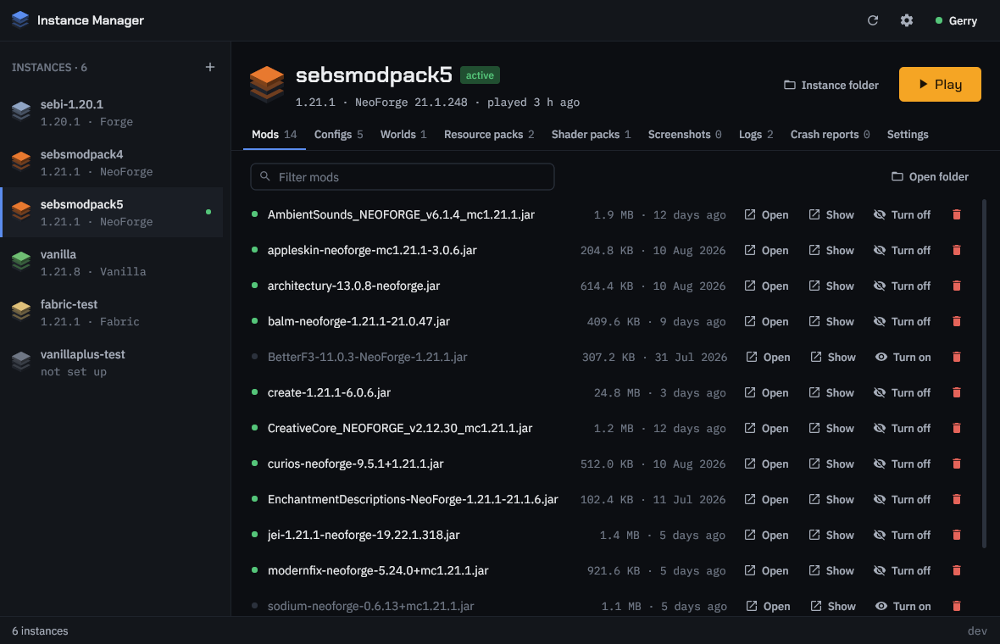

<p align="center">
  
</p>

# Minecraft Instance Manager

A Minecraft launcher and instance manager. Keep several setups side by side,
switch between them instantly, and launch them — sign-in, version, mod loader
and all — from one window.

<p align="center">
  
</p>

> 🤖 **AI collaboration notice**: this project is developed together with an AI
> assistant. The direction is human; the assistant helps with implementation,
> documentation and structure. We think it is worth being open about that.

## What it does

- **Launches the game itself** — resolves the version, downloads libraries,
  assets and natives, picks a matching Java runtime and builds the command line.
- **Shares game content between instances.** Libraries, assets, versions and
  Java runtimes live in one store instead of once per instance. On the machine
  this was developed against, six instances held 19.9 GB of duplicated files
  that deduplicate to 3.7 GB.
- **Adopts what you already have.** Instances created by the official launcher
  are read as they are: the Minecraft version, the mod loader, the heap size
  and the JVM flags are all detected from `launcher_profiles.json` and
  `versions/`.
- **Runs modded instances without an installer** where the loader profile is
  already on disk — which it is, for anything you have played before.
- **Switches with symlinks**, so the game keeps writing its saves, screenshots
  and configs into the instance directory exactly as before.
- **Puts the instance on a workbench.** Mods, configs, worlds, resource and
  shader packs, screenshots, logs and crash reports each get a tab with a
  filter. Switch a mod off without deleting it, open a config in your editor,
  show a file in the file manager, delete a world — or open the folder and
  do it your way.
- **Starts fast and stays out of the way.** Java runtimes are probed once and
  remembered; the window shows your instances before anything else happens,
  and a launch hands the game to Java in well under a second.

Supported loaders: NeoForge, Forge, Fabric and Quilt.

## Installing

### From source

```bash
git clone https://github.com/GeraldHofbauerWeb/minecraft-instance-switcher.git
cd minecraft-instance-switcher
make install
```

That builds both binaries, puts them in `~/.local/bin`, and registers the GUI
as a desktop application so it appears in the application menu.

The GUI needs a C toolchain and the Gio development headers on Linux. Where
Vulkan's headers are missing (`vulkan-headers` on Arch, `libvulkan-dev` on
Debian) the build falls back to the OpenGL backend automatically.

### Pre-built binaries

Download from the [releases page](https://github.com/GeraldHofbauerWeb/minecraft-instance-switcher/releases).
The CLI (`-cli-`) and the GUI (`-gui-`) are separate archives; the CLI is a
static binary for every platform, the GUI is built per platform.

## Using it

Run `minecraft-instance-manager-gui`, or start *Minecraft Instance Manager*
from the application menu.

1. **Sign in.** *Sign in with Microsoft* shows a code to enter at
   microsoft.com/link; the launcher waits, then stores the account and renews
   its session on its own. It needs an Azure application id (see below). A
   local account plays single-player in full but is rejected by servers running
   in online mode.
2. **Pick an instance** on the left, or press **+** to make one. New instances
   are empty and instant; duplicating an existing one copies its mods, configs
   and packs but not its worlds.
3. **Work on it.** The tabs show what the instance holds. Every entry can be
   opened with the program your desktop uses for it, shown in the file
   manager, or deleted; a mod can be switched off, which renames it to
   `.jar.disabled` — the convention other launchers use, so it stays off there
   too. *Settings* holds the Minecraft version, the loader, memory, Java and
   JVM flags, and is where an instance is renamed, duplicated or deleted.
4. **Play.** The status bar says how long the launch took and, once the game
   runs, what it last logged.

The gear opens the launcher's own settings: paths, the Java runtimes found
(one line per version, however many copies exist), and storage — where
instances made by the official launcher can be consolidated into the shared
store and their now-redundant copies freed.

### From the command line

Everything the GUI does is available in `minecraft-instance-manager`, which is
also how it is tested.

| Command | What it does |
|---|---|
| `list` | Show instances with their version, loader and counts |
| `create <name> [--clone <src>]` | Create an instance, empty by default |
| `switch <name>` | Make an instance the active one |
| `delete <name>` | Remove an instance (never the active one) |
| `restore` | Put the original `.minecraft` back |
| `instance detect [--all] [--write]` | Work out what an instance runs |
| `instance show <name>` / `instance set <name> <key> <value>` | Read and change settings |
| `launch <name>` | Launch as the signed-in account; `--offline <player>` overrides it, `--dry-run` prints the command line |
| `account login` | Sign in with a Microsoft account, by code |
| `account list` / `account use <name>` / `account remove <name>` | See and choose the account that launches |
| `account offline <name>` | Add a local account |
| `java list [--rescan]` | Every Java runtime found, including those inside instances; results are cached until a runtime changes |
| `verify [--version <id>]` | Download and check everything a version needs |
| `migrate [--dry-run]` | Build the shared store from the instances |
| `repair-perms` | Restore the executable bit on bundled Java runtimes |
| `config show` / `config <key> [path]` | Read and change paths |

## How it works

### Instances and the symlink

Instances live in `~/.minecraft-instances/<name>` (configurable). Switching
moves any real `~/.minecraft` aside and links it to the chosen instance, so the
game — and any other launcher — finds it where it expects.

Launching activates the instance first, because the game's working directory is
that symlink.

### The shared store

Everything downloadable lives once, under
`~/.config/minecraft-instance/shared`:

```
shared/
  versions/<id>/<id>.{json,jar}
  libraries/<maven path>/…
  assets/{indexes,objects,log_configs}
  natives/<id>/
  runtimes/<component>/
```

Instances keep only what is yours: `mods`, `config`, `saves`, `resourcepacks`,
`shaderpacks`, `screenshots`, `options.txt` and the rest. Every shared path is
passed to the game explicitly on the command line, which is what lets the
shared store and the symlink coexist.

`migrate` hard-links an instance's existing copies into the store. It only
reads the instances, costs no extra disk space, and deletes nothing.

### instance.json

Each instance gains an `instance.json` recording its Minecraft version, loader,
heap size, Java path and JVM arguments. Instances that predate it are read as
unconfigured; nothing is written until you save settings or launch. Run
`instance detect --all` to see what would be filled in, and `--write` to keep it.

## Microsoft sign-in

Sign-in uses the OAuth device code flow: the launcher shows a code, you enter it
in a browser, and it polls until you are done. Nothing listens on a local port
and there is no client secret — a device code client is a public client, so its
application id is not a credential and can live in the source.

From there the token is exchanged along the chain the game requires: Xbox Live,
then XSTS, then Minecraft services, then the player profile. Each step is
reported separately, because each refuses for its own reason — an account with
no Xbox profile, a child account outside a family, or one that does not own the
game are all different problems with different fixes.

It requires your own Azure application:

1. Register an application at portal.azure.com — *New registration*, account
   type *Personal Microsoft accounts only*. Leave the redirect URI empty; the
   device code flow does not use one.
2. Under *Authentication → Advanced settings*, turn on *Allow public client
   flows*. Without it the device code request is refused.
3. Request access to the Java Edition game service API at
   https://aka.ms/mce-reviewappid. Mojang reviews new application ids by hand
   and adds them to an allow list; until yours is on it, sign-in runs the whole
   chain and is refused at the last step with *Invalid app registration*.
   Launchers registered before the review process started keep their access.

Supply the id at build time (`make MSA_CLIENT_ID=<uuid>`), through
`MIM_MSA_CLIENT_ID`, or with `config msa-client-id <uuid>` — in that order of
precedence, environment first. Without one, only local accounts are offered.

The Minecraft session lasts about a day. It is renewed from the stored refresh
token at the next launch, and only when that is refused does the account ask to
sign in again.

**On credentials:** accounts are stored in
`~/.config/minecraft-instance/accounts.json` with mode 0600. The file is not
encrypted — Go has no cross-platform keyring without cgo, and claiming
otherwise would be worse than saying so.

## Platform notes

| Platform | Status |
|---|---|
| Linux | Full support |
| macOS | Supported; release builds are unsigned, so Gatekeeper needs a right-click → Open on first run |
| Windows | Symlinks need Developer Mode or an administrator; the CLI and GUI both build |

## Development

```bash
make build   # both binaries
make test    # the whole suite, no display needed
make lint    # gofmt and go vet
make run     # build and start the GUI
make install # install and register the desktop entry
```

The rule that keeps this testable: `internal/launcher` holds the application
logic and imports no Gio, `internal/gui` holds only layout. Break it and the
build fails rather than the tests quietly needing a display.

To look at the interface without running it:

```bash
GUI_SHOT_DIR=/tmp/shots go test -tags gui_screenshot -run TestRenderScreens ./internal/gui/
```

## Licence

MIT. Use it, change it, share it.

---

**Happy mining!** ⛏️
